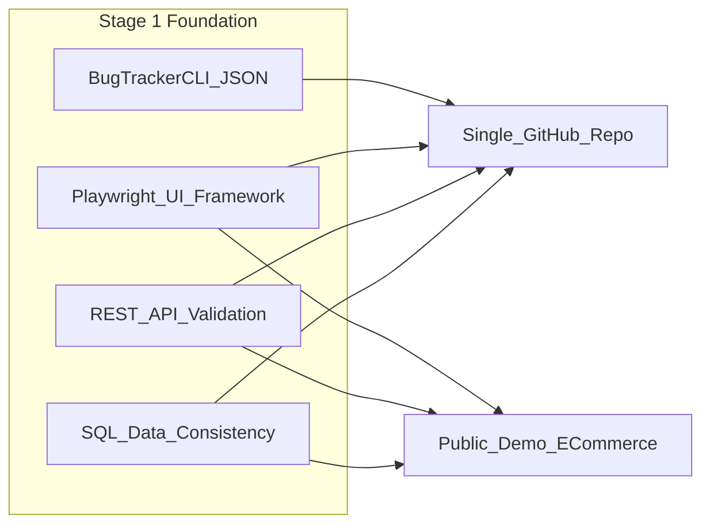

# Autonomous QA & Compliance Sentry — Stage 1 Plan

## Source documents

| Document | Role |
|----------|------|
| [Manual_to_AI_Tester_Roadmap.pdf](file:///Users/saptayh/Downloads/Manual_to_AI_Tester_Roadmap.pdf) | 9-phase learning path (6–12 months); skills, milestones, and portfolio habits |
| [Autonomous QA & Compliance Sentry.docx](file:///Users/saptayh/Downloads/Autonomous%20QA%20%26%20Compliance%20Sentry.docx) | Single evolving portfolio project in 4 stages; Stage 1 = foundation |

**Your scope (confirmed):** Stage 1 only, using a **public demo e-commerce site** (recommended default: [Sauce Demo](https://www.saucedemo.com/) — stable, login/cart/checkout flows, widely used in QA tutorials).

---

## Project preview

**Autonomous QA & Compliance Sentry** is a long-running portfolio platform that grows from classic QA automation into AI-powered auditing and reliability engineering. Instead of many unrelated tutorial apps, every milestone extends one system recruiters can follow on GitHub.

**Stage 1 (this plan)** delivers the **code and testing foundation**:



**Milestone 1A — Bug Tracker CLI**

- Python CLI: add, update status, search bugs
- Persist to structured JSON (CRUD + file I/O)
- Maps to roadmap **Phase 1** milestone: *Bug Tracker CLI App*

**Milestone 1B — E-commerce automation + backend validation**

- Playwright framework (POM): login, search, cart, checkout on Sauce Demo (or equivalent)
- pytest: fixtures, parametrization, HTML reports + screenshots on failure
- REST API checks (Python `requests` or Playwright API context where applicable)
- SQL validation layer: compare API/UI outcomes vs test DB records (consistency, missing rows, duplicates)
- Maps to roadmap **Phases 3 & 4** milestones: *E-Commerce Automation Framework* + *Data Validation Suite*

Later stages (not in this plan) add Docker/CI, queue-based runners, RAG chatbot, and AI eval/security dashboards.

---

## Goals

### Learning goals (from roadmap Phases 1, 3, 4)

- **Python foundations:** functions, OOP basics, exceptions, JSON/file handling, virtualenv/pip
- **Git workflow:** branch, commit, push, README-driven repos
- **Automation:** Playwright locators, waits, assertions, parallel runs, Page Object Model
- **API testing:** HTTP methods, status codes, auth patterns, JSON assertions
- **pytest:** fixtures, parametrization, reporting
- **SQL & backend validation:** JOINs, GROUP BY, API-vs-DB consistency checks

### Portfolio goals (from docx + roadmap closing advice)

- One **public GitHub repo** with professional `README.md` (architecture diagram, how to run CLI + tests)
- **HTML test reports** and failure screenshots
- **Database validation script** documented and runnable locally
- **2-minute demo video** (Loom or similar) embedded in README — required at end of stage, not optional polish
- Avoid tutorial hell: each milestone is runnable, pushed, and demoed

### Career positioning (north star, full roadmap)

Roles the full 9-phase path targets: QA Automation Engineer, SDET, AI QA Engineer, GenAI Test Engineer, AI Reliability Engineer. Stage 1 proves **classic automation + data validation**—the base recruiters expect before AI layers.

---

## Recommended repository layout

```
qa-compliance-sentry/
├── README.md                 # Preview, goals, architecture, demo link
├── pyproject.toml or requirements.txt
├── bug_tracker/              # Milestone 1A
│   ├── cli.py
│   ├── models.py
│   └── storage.py            # JSON CRUD
├── tests/
│   ├── unit/                 # CLI tests
│   └── e2e/
│       ├── conftest.py       # pytest + Playwright fixtures
│       ├── pages/            # POM: login, inventory, cart, checkout
│       └── test_checkout_flow.py
├── api/                      # Optional thin client for API assertions
├── db/
│   └── validation.py         # SQL checks vs expected state
├── reports/                  # gitignored HTML/screenshots
└── .github/                  # placeholder only in Stage 1 (CI in Stage 2)
```

---

## Implementation sequence

### 1. Bootstrap project

- Create repo (e.g. `~/qa-compliance-sentry` or `~/Developer/qa-compliance-sentry`), `git init`, Python 3.11+ venv
- Dependencies: `pytest`, `pytest-playwright`, `playwright`, `requests`, DB driver (`sqlite3` stdlib for local fixture DB **or** `psycopg2`/`sqlalchemy` if you seed Postgres for validation exercises)
- `playwright install` for browsers

### 2. Milestone 1A — Bug Tracker CLI

- Implement JSON schema for bugs (`id`, `title`, `status`, `severity`, `created_at`, etc.)
- CLI entry (`argparse` or `typer`): `add`, `update`, `search`, `list`
- Unit tests with temp JSON files
- README section: CLI usage examples

### 3. Milestone 1B — Playwright framework

- **Target:** Sauce Demo (`standard_user` / `secret_sauce`) — login → inventory → cart → checkout
- Page objects: `LoginPage`, `InventoryPage`, `CartPage`, `CheckoutPage`
- Assertions: URL, visible text, cart count, order confirmation
- pytest markers: `@pytest.mark.smoke`, optional `@pytest.mark.regression`
- Reporting: `pytest-html` or Playwright HTML reporter; screenshots on failure
- Optional: `pytest-xdist` for parallel smoke runs

### 4. API + SQL validation (Phase 4 alignment)

- **Pragmatic Stage-1 approach for a public demo:** Sauce Demo has no public DB for candidates. Use a **local SQLite (or Docker Postgres) seed database** that mirrors *test scenarios you define* (orders, users, inventory snapshots). After UI actions, run validation queries to assert:
  - Expected rows exist / none missing
  - No duplicate keys where uniqueness matters
  - API fixture responses (mock or test double) match DB when you simulate backend checks
- Document in README that production would hit real API+DB; locally you demonstrate the **validation pattern** from the roadmap’s *Data Validation Suite*
- If you later add a self-hosted demo API+DB, swap the seed DB for live checks without changing POM structure

### 5. Portfolio finish line (Stage 1 Definition of Done)

- [ ] CLI and e2e tests pass locally with documented commands
- [ ] README: project preview, goals, setup, architecture diagram, test strategy
- [ ] Demo video recorded and linked
- [ ] No secrets in repo (use `.env.example` for any future API keys)

---

## Out of scope (Stage 2+)

Per docx and your scope choice — defer to a follow-up plan:

- Docker + GitHub Actions CI (Stage 2A)
- Log analyzer / flaky-test detection with DSA structures (Stage 2B)
- Queue-based parallel workers (Phase 6)
- RAG chatbot, DeepEval/Ragas, AI security testing (Stages 3–4)

---

## Phase 2 note (DSA)

Roadmap **Phase 2** (*Automation Log Analyzer* with HashMaps/heaps) is intentionally **not** in Stage 1. After Stage 1 ships, a small follow-on milestone can parse pytest/Playwright logs before starting infrastructure work.

---

## Execution prerequisites

When you approve this plan for implementation:

1. Call `create_project` / `move_agent_to_root` to the new repo path (not home directory)
2. Implement milestones in order: 1A → 1B → validation → README/video

No code changes until you explicitly say to **execute** or **implement** the plan.
