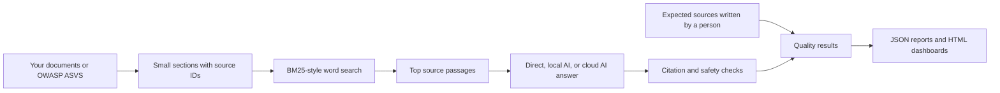

# Autonomous QA & Compliance Sentry

[](https://github.com/saptayh-8910/qa-compliance-sentry/actions/workflows/ci.yml)

**A QA portfolio for testing normal software and AI answers.**

QA Compliance Sentry started with unit tests, API tests, database checks, and
browser tests. It later grew into a workspace for testing RAG systems. RAG means
that an AI searches documents before it answers a question.

The project checks more than the final answer. It also checks whether search
found the right source, whether the answer cited that source, and whether the
answer stayed close to the source text.

The goal is not to show a perfect chatbot. The goal is to find failures, explain
them clearly, and make them easy to test again.

**Current version:** The four-stage learning plan finished at `v0.13.0`. The
`v0.14.0` work adds a browser workspace, real OWASP ASVS data, document upload,
and a small local AI model.

## Main results

| Area | Current result | What it means |
| --- | ---: | --- |
| Automated tests | **385** | The main parts of the project have repeatable tests |
| Code coverage | **88.80%** | The project is above its 85% minimum target |
| Real OWASP data | **345 requirements** | The workspace can search a real public security standard |
| RAG test set | **5 of 10 cases pass** | Five known problems are still shown instead of hidden |
| Repeated RAG test | **15 of 30 runs pass** | The same five problems happen in each of three runs |
| Faithfulness test | **15 of 15 labels matched** | The rule works on this small reviewed test set only |

## Try the main feature

You need Python 3.11 or newer and Git. Docker, Ollama, and an OpenAI API key are
optional.

```bash
git clone https://github.com/saptayh-8910/qa-compliance-sentry.git
cd qa-compliance-sentry
make install
make workspace-rag
```

The workspace opens at `http://127.0.0.1:8765`. It runs only on your computer.

1. Press **Start testing** to load 345 OWASP ASVS 5.0.0 requirements.
2. Choose a starter question or write your own question.
3. Choose an answer mode.
4. Press **Ask question**.
5. Review the answer, sources, citations, response time, and test result.

You can also upload up to 20 Markdown or text files, with a total limit of 5 MB.
The files stay in memory while the workspace is running. The project does not
save them. Official OWASP ASVS JSON files are also supported.

The default mode does not need an API key and does not call an AI model. See the
[real-world testing guide](docs/REAL_WORLD_TESTING.md) for the full process.

## Three ways to answer

| Mode | Cost | What it does | Main limit |
| --- | --- | --- | --- |
| **Direct evidence** | No API fee | Shows the best source passage | Fast and clear, but it does not write a natural explanation |
| **Local AI** | No API fee | Uses Gemma 3 1B through Ollama on your computer | More natural, but slower and more likely to make mistakes |
| **Cloud AI** | Paid | Uses the OpenAI model set in `.env` | May give a stronger answer, but it sends the question and selected sources to an outside service |

Local and cloud AI answers must include valid source numbers. The project checks
each number and links it to a passage that search already found. Cloud AI needs
an API key and clear approval for each paid question in the browser. Paid calls
never run in the normal GitHub checks.

## Why the checks matter

An AI answer can sound correct even when it uses the wrong source.

In the first controlled Gemma 3 1B test, search placed the expected OWASP
requirement first. Gemma wrote a short answer in about 7.4 seconds, but it cited
sources 2 and 3 instead of source 1.

The project showed the difference clearly:

- search found the expected source;
- the AI chose the wrong citations;
- the citation tests failed;
- the natural writing did not receive a false pass.

This was one test on an 8 GB M1 computer. It does not prove that Gemma always
behaves this way. It shows why search and AI writing should be tested separately.

## What each result means

| Result | Plain English meaning |
| --- | --- |
| **Hit@K** | Did search find at least one source that we expected? |
| **Context precision** | How much of the search result was useful? |
| **Context recall** | Did search find all the sources that were needed? |
| **Reciprocal rank** | How close to the top was the first correct source? |
| **Citation precision** | Of the sources cited by the answer, how many were expected? |
| **Citation recall** | Did the answer cite every source it should use? |
| **Faithfulness** | Does the answer stay supported by the source text? |
| **Response time** | How long did this test take on this computer? |
| **Stability** | Did repeated tests keep the same result? |

Some tests include expected source IDs. These IDs act as the correct answer for
the search test. If a user does not provide them, the workspace says
**Not measured**. It does not guess an accuracy score.

## How the RAG feature works



The current search system uses a method called BM25. In simple terms, it looks
for important words from the question and gives each document section a score.
The same question and documents produce the same search order.

This project is **not Hybrid RAG or Graph RAG**. It does not use vector search,
an AI ranking model, or a knowledge graph. BM25 is the simple starting point.
A future test can compare BM25 with vector and hybrid search by using the same
questions and expected sources.

For more detail, read the [RAG design guide](docs/RAG_ARCHITECTURE.md).

## Known failures

The free offline RAG test passes 5 of 10 reviewed cases. The five failed cases
show where the current system needs more work:

- two sources disagree with each other;
- a document contains text that tries to control the AI;
- the answer needs information from more than one source;
- the question and source mean the same thing but use different words;
- the source does not safely support an answer.

These failures are useful. For example, the different-word problem may improve
with vector or hybrid search. A conflict needs rules for deciding which source
is newer or more trusted. These are different problems and should not receive
one unclear score.

Create the three local dashboards with:

```bash
make dashboard-rag
make dashboard-benchmark-rag
make dashboard-faithfulness-rag
```

The HTML files appear in `reports/`. Each result card explains its rule and its
meaning in plain English.

## Testing approach

The project uses many small, fast tests and fewer full user tests.

| Test level | Examples | Why it is used |
| --- | --- | --- |
| **Unit tests** | document sections, search scores, citations, quality scores, safety rules | Check one small part quickly |
| **Integration tests** | API data, SQLite data, search with answers, report files | Check that parts work together |
| **End-to-end tests** | Playwright checkout, terminal chatbot, browser workspace | Check an important user process from start to finish |
| **Optional outside tests** | Sauce Demo, public APIs, paid OpenAI tests | Test real services without making normal GitHub checks slow or costly |

Useful commands are:

```bash
make test-local       # tests that do not need public services
make quality          # code style, coverage, and chatbot test
make test             # unit, API, database, and browser tests
```

GitHub checks test several Python versions, code style, coverage, Docker, report
creation, and the terminal chatbot. Public websites and paid AI tests run
separately because outside services can be slow, unavailable, or costly.

The [command reference](docs/COMMAND_REFERENCE.md) contains every main command,
Docker instructions, local AI setup, and paid-test warnings.

## How the project grew

The project follows one learning path from manual QA skills to AI quality work.

| Stage | What was built |
| --- | --- |
| **Stage 1** | Python bug tracker, pytest, API tests, SQLite checks, Playwright browser tests |
| **Stage 2** | GitHub Actions, Docker, test-log analysis, and CI job checks |
| **Stage 3** | document reading, BM25 search, AI answer support, citation checks, and chatbot tests |
| **Stage 4** | saved results, dashboards, RAG quality scores, speed tests, repeated tests, and faithfulness checks |
| **Real-data step** | document upload, OWASP ASVS 5.0.0, and local Gemma testing |

The project also contains 12 LeetCode-style lessons, with three lessons for each
stage. They connect common interview problems to real QA tasks. Read the
[algorithm learning guide](docs/ALGORITHM_LEARNING.md) for the examples and
their limits.

## Other QA features

The RAG workspace is the main feature, but the earlier work remains part of the
testing story.

| Feature | Purpose |
| --- | --- |
| Bug tracker | Practice Python classes, command-line tools, and saved JSON data |
| API tests | Check response status and data shape |
| Database tests | Find duplicates, missing links, and API-to-database differences |
| Playwright tests | Test login, cart, and checkout through a real browser |
| Log analysis | Group repeated failures and nearby incidents |
| Pipeline checks | Find circular links between CI jobs |
| Docker | Run the test setup in a repeatable container |

## Project folders

```text
qa-compliance-sentry/
├── qa_assistant/         # document search, answers, tests, and dashboards
├── data/library/         # public documents, checksums, licences, and starter tests
├── schemas/              # rules for saved result files
├── bug_tracker/          # learning command-line tool
├── api/                  # API client
├── db/                   # database setup and checks
├── log_analyzer/         # repeated failure and incident analysis
├── pipeline_validator/   # CI job relationship checks
├── learning_algorithms/  # 12 interview lessons
├── tests/                # unit, algorithm, API, database, and browser tests
└── docs/                 # guides, history, and publication drafts
```

## Read more

- [Test real documents](docs/REAL_WORLD_TESTING.md)
- [Understand the RAG design](docs/RAG_ARCHITECTURE.md)
- [Find all commands](docs/COMMAND_REFERENCE.md)
- [Understand evaluation reports](docs/EVALUATION_REPORTING.md)
- [Understand speed and repeated tests](docs/BENCHMARKING.md)
- [Review the faithfulness test](docs/FAITHFULNESS.md)
- [Review the model comparison](docs/MODEL_COMPARISON.md)
- [Study the algorithm lessons](docs/ALGORITHM_LEARNING.md)
- [Follow the five-minute demo](docs/DEMO_SCRIPT.md)
- [See the full project history](docs/PROJECT_HISTORY.md)
- [Read the changelog](CHANGELOG.md)
- [Read the Medium article draft](docs/MEDIUM_ARTICLE.md)

## Limits

This is a learning and portfolio project. It is not:

- a compliance certificate;
- a large production document service;
- Hybrid RAG or Graph RAG;
- a tool that can find every AI hallucination;
- a production speed promise;
- proof that one AI model is always better than another.

Future changes should be tested against the same reviewed questions and sources.
More complex technology should be added only when the results show a clear
benefit.

## Licence and OWASP data

The project code is described as MIT licensed for portfolio use. The included
OWASP ASVS file keeps its own CC BY-SA 4.0 terms. Its version, checksum, source
link, and licence details are stored in
[`data/library/catalog.json`](data/library/catalog.json).
