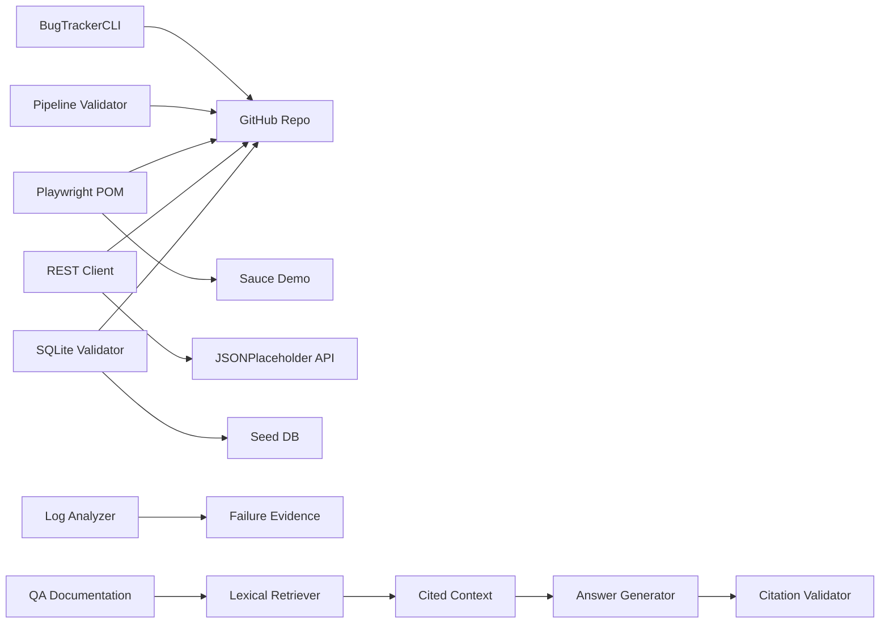

# Autonomous QA & Compliance Sentry

[](https://github.com/saptayh-8910/qa-compliance-sentry/actions/workflows/ci.yml)

**Stage 3 — Grounded, Citation-Aware RAG Assistant**

A portfolio platform that evolves from classic QA automation into AI-powered auditing and reliability engineering. Stage 1 delivers a bug-tracker CLI, Playwright UI framework against [Sauce Demo](https://www.saucedemo.com/), REST API checks, and SQLite data-consistency validation.
Stage 2 makes those checks reproducible in CI and Docker while adding failure
intelligence. Stage 3 now connects deterministic document retrieval to a
provider-neutral grounded-answer boundary with fail-closed citation validation.

## Why this project exists

This project turns a Manual→AI Tester learning roadmap into one evolving,
runnable portfolio instead of a collection of disconnected tutorials. Stage 1
builds the Python, browser automation, API testing, pytest, and SQL foundation
expected for QA Automation and SDET roles. Later stages can add CI/CD,
reliability tooling, retrieval-augmented generation, and AI evaluation without
discarding the earlier work.

The repository's evolution is recorded in [CHANGELOG.md](CHANGELOG.md) and the
detailed [project history](docs/PROJECT_HISTORY.md), including milestone pull
requests, merge commits, test growth, coverage, and the planned release tags.

## Project preview

| Component | Description |
|-----------|-------------|
| **Bug Tracker CLI** | Python CLI with JSON persistence — add, update status, search, list |
| **E2E Framework** | Playwright + pytest Page Object Model (login → cart → checkout) |
| **API validation** | HTTP contract checks via a thin `requests` client |
| **DB validation** | Seeded SQLite DB + SQL scripts for duplicates, orphans, API↔DB alignment |
| **Continuous integration** | Ruff, coverage gates, Python compatibility, reports, scheduled external tests |
| **Containerized testing** | Pinned Playwright image, non-root execution, reproducible local/CI commands |
| **Failure intelligence** | JSONL log analysis, recurring-failure ranking, incident-window consolidation |
| **Pipeline validation** | Graph-based cycle detection for named CI job dependencies |
| **Algorithm foundations** | Stage-aligned interview labs with canonical and QA-oriented tests |
| **QA documentation assistant** | Deterministic retrieval, grounded answers, verified citations, and adversarial evaluation |



## AI Quality Engineering

Stage 3 treats the RAG assistant as a quality system with independently
testable retrieval, generation, safety, citation, and efficiency behavior—not
just another API endpoint.

| AI quality area | Status | Test and evidence |
|---|---|---|
| **Hallucination detection** | Implemented with a bounded rubric | Unsupported questions and unresolved conflicts must return the exact abstention response. Required and forbidden terms detect known missing or invented claims; full claim-level semantic faithfulness remains Stage 4 work. |
| **Prompt injection** | Implemented | Retrieved text contains a malicious instruction, while the answer must follow the system grounding contract, omit the injected response, and retain a valid citation. |
| **Context recall** | Implemented | Human-labelled chunks produce context precision/recall, Hit@K, and reciprocal rank/MRR so retrieval failures are separated from generation failures. |
| **Citation verification** | Implemented | Numeric citations fail closed, map to canonical sources, and produce citation precision/recall plus an exact-source gate for curated cases. |
| **Latency benchmarking** | Foundation implemented | External results retain per-case latency and token usage. Repeated samples and percentile comparisons are intentionally deferred until the evaluation dataset is larger. |
| **Regression across models** | Ready as an opt-in test | The same four cases and deterministic rubric compare Sol/Medium with Luna/High. Eight result rows require exactly six paid calls because retrieval misses skip generation. |

All current grading labels are human-authored, version-controlled, and scored
deterministically; no unvalidated LLM acts as the judge. See the
[RAG evaluation methodology](docs/RAG_ARCHITECTURE.md#evaluation-metrics-and-grading)
and [model comparison record](docs/MODEL_COMPARISON.md) for metric definitions,
experiment boundaries, and limitations.

## Goals (Stage 1)

**Learning:** Python, Git, Playwright, pytest, REST APIs, SQL consistency patterns.

**Portfolio:** One repo with README, HTML reports, failure screenshots, runnable validation script, and a short demo video.

**Career path:** Foundation for QA Automation / SDET roles before Stages 2–4 (CI/CD, AI RAG, LLM evaluation).

## Quick start

### Prerequisites

- Python 3.11+
- Docker Desktop or Docker Engine (for container commands)
- Network access (Sauce Demo + API tests)

### Setup

```bash
git clone <your-repo-url> qa-compliance-sentry
cd qa-compliance-sentry
make install
cp .env.example .env   # optional — defaults work for Sauce Demo
```

### Bug Tracker CLI (Milestone 1A)

```bash
.venv/bin/bug-tracker add "Cart total incorrect" --severity high
.venv/bin/bug-tracker list
.venv/bin/bug-tracker search cart
.venv/bin/bug-tracker update <BUG_ID> --status in_progress
```

Data is stored in `data/bugs.json` by default.

### Stage 1 algorithm foundations

The retrospective foundation lab covers three common interview patterns:

- **Two Sum:** hash-map complement lookup, applied to paired test metrics.
- **Contains Duplicate:** set-based duplicate test-case ID detection.
- **Binary Search:** logarithmic lookup in sorted bug or test identifiers.

Run all implemented algorithm lessons with:

```bash
make test-algorithms
```

These implementations teach the underlying data structures. Production code
should still use database uniqueness constraints, Python built-ins, or indexed
queries when those tools better fit the requirement.

### Stage 3 algorithm foundations

The RAG milestone adds three interview patterns and uses each through the
production QA-assistant path:

- **Valid Parentheses:** a stack checks generated `()`, `[]`, and `{}` before
  citation parsing accepts an answer.
- **LRU Cache:** a hash map plus doubly linked list caches ranked retrieval
  results with O(1) lookup, refresh, and eviction.
- **Trie:** a prefix tree indexes canonical document source paths and returns
  deterministic prefix matches.

Canonical LeetCode-style examples, edge cases, and QA-oriented applications all
run through `make test-algorithms`. See the
[algorithm learning track](docs/ALGORITHM_LEARNING.md) for complexity analysis,
interview questions, and production boundaries. Bracket balancing is a shallow
structural guard rather than JSON Schema validation, and the in-memory cache is
not a distributed persistence layer.

### Retrieve QA documentation

Stage 3 starts with an offline retrieval boundary that can be tested without an
API key:

```bash
make retrieve-docs

# Or query selected Markdown/text sources:
.venv/bin/qa-assistant retrieve \
  "Why separate scheduled external checks from merge-blocking tests?" \
  --source docs --top 3
```

The command discovers `.md` and `.txt` files, splits Markdown at real headings,
ranks chunks with deterministic BM25-style lexical scoring, and prints bounded
context labelled with source and heading citations. It does **not** generate an
LLM answer yet; keeping retrieval separate makes ranking and citation failures
observable before model behavior is introduced. See
[the Stage 3 RAG architecture](docs/RAG_ARCHITECTURE.md).

Run the complete offline question-answer flow with:

```bash
make answer-docs

.venv/bin/qa-assistant answer \
  "Why separate scheduled external checks from merge-blocking tests?" \
  --source docs --top 3
```

The default extractive generator returns bounded text from the best retrieved
passage and a verified source list. It remains the fast, zero-cost CI baseline.
The OpenAI adapter implements the same provider-neutral contract through the
Responses API and is enabled only when explicitly selected.

To use the external provider, put your API key in the ignored local `.env` file:

```dotenv
OPENAI_API_KEY=your-key-here
OPENAI_MODEL=gpt-5.6-sol
OPENAI_REASONING_EFFORT=medium
```

Then run:

```bash
.venv/bin/qa-assistant answer \
  "Why separate scheduled external checks from merge-blocking tests?" \
  --source docs --top 3 --provider openai
```

This command makes a paid external API request. The adapter sends grounding
instructions separately from the question and retrieved evidence, requests no
response storage, limits output size, and passes the result through the same
numeric citation validator as the offline generator.

The model and reasoning effort can be changed independently. For example, this
runs the same answer flow with Luna at high reasoning:

```bash
.venv/bin/qa-assistant answer \
  "Why separate scheduled external checks from merge-blocking tests?" \
  --source docs --provider openai \
  --model gpt-5.6-luna --reasoning-effort high
```

`make test-ai-external` performs a controlled comparison of Sol/Medium and
Luna/High across a fixed four-case dataset: supported evidence, no evidence,
conflicting evidence, and prompt injection inside a retrieved document. The
no-evidence path must skip generation, so the matrix makes exactly six paid API
calls rather than eight. It checks required and forbidden terms, expected
behavior, and exact citation sources. Human-labelled relevant chunks also
produce context precision/recall, Hit@K, reciprocal rank, and citation
precision/recall. Each live result records those metrics plus latency and API
token usage in HTML and JUnit evidence under `reports/`. The experiment design,
first baseline result, and remaining limitations are recorded in
[docs/MODEL_COMPARISON.md](docs/MODEL_COMPARISON.md).

The same evaluation runner is covered by deterministic fake-model tests in
ordinary CI. This is a transparent rule-based rubric, not an LLM-as-judge or a
claim that keyword checks prove full semantic entailment. It can aggregate case
pass rate and the applicable retrieval and citation metrics while leaving
no-answer metrics explicitly not applicable.

### Run tests

```bash
make test-unit    # deterministic component/unit tests
make test-algorithms # interview algorithms mapped to QA features
make test-api     # REST API tests
make test-db      # SQLite validation tests
make test-e2e     # Sauce Demo smoke (Playwright)
make test-ai-external # opt-in six-call adversarial Sol/Luna comparison
make test-local   # deterministic unit + DB tests, no network
make test         # unit + api + db + e2e smoke
make quality      # lint + format check + coverage gate
make validate     # seed the demo DB, then run read-only SQL checks
make validate-pipeline # detect circular CI job dependencies
make report       # full suite + HTML report in reports/
```

### Analyze QA logs

```bash
make analyze-sample

# Or analyze another newline-delimited JSON file:
.venv/bin/log-analyzer analyze path/to/test-run.jsonl \
  --top 5 --incident-gap-seconds 300 \
  --output reports/log-analysis.json
```

Each input line contains an ISO-8601 `timestamp`, `level`, and `message`, with
an optional `test_name`. The analyzer ranks exact recurring failure signatures
and merges nearby failures into incident windows. See
[the algorithm learning track](docs/ALGORITHM_LEARNING.md) for the interview
problems, complexity analysis, and practical tradeoffs behind this feature.

### Validate CI dependencies

```bash
make validate-pipeline

# Or validate another pipeline definition:
.venv/bin/pipeline-validator validate path/to/pipeline.json
```

Pipeline JSON declares a list of unique job names and dependency pairs in
`[job, prerequisite]` order. The validator uses topological sorting to confirm
that every job can run without a circular dependency.

### Run with Docker

```bash
make docker-test      # build image + deterministic tests
make docker-quality   # Ruff + coverage gate + reports
make docker-external  # public API + Playwright tests
```

The image pins Playwright 1.61.0 in both Python and the official Noble-based
browser image. Containers run as the unprivileged `pwuser` account. Chromium
runs use Docker's recommended `--init` and `--ipc=host` options, and generated
evidence is written to the local `reports/` directory.

To load custom Sauce Demo settings from `.env`, pass Docker arguments explicitly:

```bash
make docker-external DOCKER_ENV_ARGS="--env-file .env"
```

### E2E with HTML report

```bash
.venv/bin/pytest tests/e2e -m smoke \
  --html=reports/e2e-report.html --self-contained-html
```

Failure screenshots are saved under `reports/`.

## Test strategy

| Layer | Tool | Target |
|-------|------|--------|
| Unit | pytest | Components, isolated API client, ingestion, retrieval, citations, and evaluation rubrics |
| Algorithms | pytest | Interview fundamentals reused by QA features |
| API | pytest + requests | REST shape & status (JSONPlaceholder stand-in) |
| DB | pytest + sqlite3 | Seed DB duplicates, FK integrity, API↔DB mapping |
| E2E | pytest-playwright | Sauce Demo checkout happy path |
| AI E2E | pytest + OpenAI Responses API | Opt-in grounding and prompt-injection model comparison |

**Markers:** `smoke`, `regression`, `api`, `db`, `external`, `ai`

Tests marked `external` require public network access. Database tests use local
fixtures only, and `DataValidator` opens its target in read-only mode so a
validation run cannot silently create or repair the database under inspection.

## Continuous integration

The deterministic workflow runs Ruff, enforces at least 85% branch-aware test
coverage, and tests supported Python versions on pull requests and updates to
`main`. It also builds the Docker image, verifies that it runs as a non-root
user, and executes the deterministic suite inside the container. HTML, XML,
and JUnit reports are uploaded for inspection.

Public API and Playwright checks run in a separate workflow every Monday at
03:00 UTC or on demand from the GitHub Actions page. Keeping that workflow
separate prevents temporary public-service failures from blocking code changes.

Sauce Demo has no public candidate API/DB. The SQLite seed DB demonstrates the **data validation pattern** from the roadmap; swap in a real API+DB later without changing the POM structure.

## Repository layout

```
qa-compliance-sentry/
├── bug_tracker/          # CLI + JSON storage
├── api/                  # HTTP client
├── db/                   # schema, seed, validation.py
├── log_analyzer/         # JSONL parsing, failure ranking, incident grouping
├── learning_algorithms/  # Interview labs mapped to project stages
├── pipeline_validator/   # CI dependency graph and cycle validation
├── qa_assistant/         # Retrieval, grounded answers, and evaluation rubrics
├── examples/             # runnable sample QA logs
├── tests/
│   ├── unit/
│   ├── algorithms/
│   ├── api/
│   ├── db/
│   └── e2e/pages/        # Page Object Model
├── scripts/run_validations.py
└── reports/              # HTML + screenshots (gitignored)
```


## Roadmap alignment

| Stage | This repo |
|-------|-----------|
| **Stage 1 (complete)** | CLI, Playwright, API/DB validation, algorithm foundations |
| **Stage 2 (complete)** | GitHub Actions, Docker, log analysis, algorithm foundations |
| **Stage 3 (in progress)** | Retrieval, grounded answers, OpenAI adapter, adversarial evaluation, and algorithm foundations complete; chatbot E2E next |
| Stage 4 | DeepEval / Ragas AI evaluation dashboard |

Based on the Manual→AI Tester roadmap (Phases 1, 3, 4) and the *Autonomous QA & Compliance Sentry* portfolio doc.

See [docs/DEMO_SCRIPT.md](docs/DEMO_SCRIPT.md) for a timed recording script.

## License

MIT — portfolio use.
# qa-compliance-sentry
