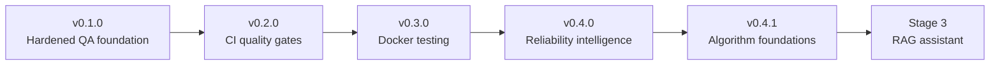

# Project history

This document explains how the Autonomous QA & Compliance Sentry evolved from
a QA automation foundation into a reliability and AI-quality learning platform.
It complements the concise release entries in [CHANGELOG.md](../CHANGELOG.md).

Deleting a merged feature branch does not remove its history. The merge commit
remains on `main`, and the corresponding GitHub pull request retains its
description, file diff, discussion, and CI results.

## Evolution



The repository began on 2026-06-07 with the Stage 1 automation foundation:
the bug-tracker CLI, Playwright Page Object Model, API checks, and SQLite data
validation. The later pull requests made that foundation reproducible, added
reliability tooling, and connected interview fundamentals to practical QA work.

## Milestones

Dates below are GitHub merge dates in UTC. Test figures are the validation
evidence recorded in each pull request, so they show how the suite grew.

| Version | Milestone | Evidence at merge | Pull request | Merge commit |
|---|---|---|---|---|
| 0.1.0 | Hardened Stage 1 validation and test isolation | 19 full, 14 deterministic, 7 DB checks | [#1](https://github.com/saptayh-8910/qa-compliance-sentry/pull/1), 2026-07-31 | [`ed550d7`](https://github.com/saptayh-8910/qa-compliance-sentry/commit/ed550d73e8da6cb830ab8a8e230c81157a7c710d) |
| 0.2.0 | Added CI, Python compatibility, reports, and quality gates | 25 full, 20 deterministic, 95.88% coverage | [#2](https://github.com/saptayh-8910/qa-compliance-sentry/pull/2), 2026-08-03 | [`a5e8512`](https://github.com/saptayh-8910/qa-compliance-sentry/commit/a5e85121495d00804dfc99d7b73db9758c2d312d) |
| 0.3.0 | Added reproducible non-root Playwright Docker testing | 20 deterministic and 5 external container tests, 95.88% coverage | [#3](https://github.com/saptayh-8910/qa-compliance-sentry/pull/3), 2026-08-04 | [`8e7222e`](https://github.com/saptayh-8910/qa-compliance-sentry/commit/8e7222e1bb66714fffd461daa647f29ee5071f47) |
| 0.4.0 | Added log analysis, CI dependency validation, and Stage 2 algorithms | 68 deterministic, 19 algorithm tests, 95.41% coverage | [#4](https://github.com/saptayh-8910/qa-compliance-sentry/pull/4), 2026-08-05 | [`cfc9e8c`](https://github.com/saptayh-8910/qa-compliance-sentry/commit/cfc9e8c3c101bcc685a12146ec4ac67f65d7a01e) |
| 0.4.1 | Added Stage 1 algorithm foundation lab | 84 deterministic, 16 new foundation cases, 95.73% coverage | [#5](https://github.com/saptayh-8910/qa-compliance-sentry/pull/5), 2026-08-05 | [`0cbf054`](https://github.com/saptayh-8910/qa-compliance-sentry/commit/0cbf0545f9f084131ec0a1d12d6fda7163f0069e) |

## What each milestone taught

### v0.1.0 — trustworthy validation

The original suite mostly proved that known-good data passed. The hardening
milestone introduced negative cases, read-only validation, isolated HTTP tests,
atomic persistence, and a deterministic offline test path. The lesson was that
a useful test must be able to fail for the right reason.

### v0.2.0 — repeatable quality gates

Local commands became automated pull-request checks. The project separated
deterministic merge-blocking tests from scheduled external checks, exercised
four supported Python versions, and retained evidence as workflow artifacts.
The lesson was to design CI around signal, speed, and dependency stability.

### v0.3.0 — reproducible execution

The official browser environment was pinned to the Python Playwright version,
the application ran without root privileges, and the same quality paths worked
locally and in CI. The lesson was that environment consistency is part of test
reliability.

### v0.4.0 — reliability intelligence

Stage 2 moved beyond executing tests into interpreting failure evidence. The
log analyzer ranks recurring signatures and consolidates incident windows; the
pipeline validator detects dependency cycles. Three interview algorithms were
implemented and then reused by real QA-oriented features.

### v0.4.1 — explicit foundations

The retrospective learning lab added hashing, sets, and binary search without
forcing handwritten algorithms into production paths where database constraints
or built-ins are safer. The lesson was to understand the underlying mechanism
and also know when not to use it.

## Planned release tags

The following annotated tags should be created after this history document is
merged. Each tag points to the merge commit where that version was completed.

| Tag | Commit | Meaning |
|---|---|---|
| `v0.1.0` | `ed550d7` | Hardened Stage 1 foundation |
| `v0.2.0` | `a5e8512` | CI and quality gates |
| `v0.3.0` | `8e7222e` | Docker testing |
| `v0.4.0` | `cfc9e8c` | Reliability intelligence |
| `v0.4.1` | `0cbf054` | Algorithm foundations |

## Inspecting history

View the compact main-branch history:

```bash
git log --oneline --graph --decorate main
```

Inspect one milestone:

```bash
git show 0cbf054
```

Compare two tagged milestones after tags are published:

```bash
git diff v0.1.0..v0.4.1 --stat
git log v0.1.0..v0.4.1 --oneline
```

List merged pull requests with the GitHub CLI:

```bash
gh pr list --state merged
```

The pull request is the best place to review why a milestone was introduced;
the commit and tag are the best references for its exact repository state.
