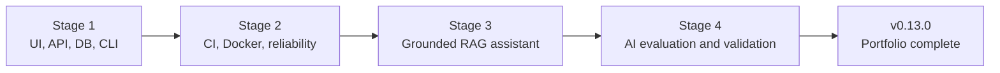

# Project history

This document records how the Autonomous QA & Compliance Sentry evolved from
classic test automation into an AI quality engineering portfolio. It
complements the release-oriented [changelog](../CHANGELOG.md).

Deleting a merged feature branch does not remove its work. The merge commit
remains on `main`, and its GitHub pull request retains the description, diff,
discussion, and CI evidence.

## Evolution



The repository began with a bug-tracker CLI, Playwright Page Object Model, API
checks, and SQLite consistency validation. It then added deterministic CI,
containerized execution, failure intelligence, a citation-aware documentation
assistant, RAG quality metrics, model comparison, safe dashboards, repeated
latency and stability evidence, and human-labelled faithfulness validation.

## Milestones

Dates are GitHub merge dates in UTC. Versions show the package version at each
merge. Test figures are stated only where the repository recorded exact
evidence; the final closeout baseline is 342 deterministic tests at 92.34%
branch-aware coverage plus one chatbot E2E journey.

| Version | Milestone | Pull request and date | Merge commit |
|---|---|---|---|
| 0.1.0 | Hardened Stage 1 validation and test isolation | [#1](https://github.com/saptayh-8910/qa-compliance-sentry/pull/1), 2026-07-31 | [`ed550d7`](https://github.com/saptayh-8910/qa-compliance-sentry/commit/ed550d73e8da6cb830ab8a8e230c81157a7c710d) |
| 0.2.0 | Added CI, Python compatibility, reports, and quality gates | [#2](https://github.com/saptayh-8910/qa-compliance-sentry/pull/2), 2026-08-03 | [`a5e8512`](https://github.com/saptayh-8910/qa-compliance-sentry/commit/a5e85121495d00804dfc99d7b73db9758c2d312d) |
| 0.3.0 | Added reproducible non-root Playwright Docker testing | [#3](https://github.com/saptayh-8910/qa-compliance-sentry/pull/3), 2026-08-04 | [`8e7222e`](https://github.com/saptayh-8910/qa-compliance-sentry/commit/8e7222e1bb66714fffd461daa647f29ee5071f47) |
| 0.4.0 | Added log analysis, pipeline validation, and Stage 2 algorithms | [#4](https://github.com/saptayh-8910/qa-compliance-sentry/pull/4), 2026-08-05 | [`cfc9e8c`](https://github.com/saptayh-8910/qa-compliance-sentry/commit/cfc9e8c3c101bcc685a12146ec4ac67f65d7a01e) |
| 0.4.1 | Added retrospective Stage 1 algorithm foundations | [#5](https://github.com/saptayh-8910/qa-compliance-sentry/pull/5), 2026-08-05 | [`0cbf054`](https://github.com/saptayh-8910/qa-compliance-sentry/commit/0cbf0545f9f084131ec0a1d12d6fda7163f0069e) |
| 0.4.1 | Documented permanent project history | [#6](https://github.com/saptayh-8910/qa-compliance-sentry/pull/6), 2026-08-06 | [`1d44265`](https://github.com/saptayh-8910/qa-compliance-sentry/commit/1d442658f2c06a1d85690ee6235257054f73ad17) |
| 0.5.0 | Added citation-aware document ingestion and retrieval | [#7](https://github.com/saptayh-8910/qa-compliance-sentry/pull/7), 2026-08-06 | [`1c0183f`](https://github.com/saptayh-8910/qa-compliance-sentry/commit/1c0183fe5ed636e3baa7a7b61f444c7aec3c5fd0) |
| 0.5.1 | Added grounded generation, abstention, and citation enforcement | [#8](https://github.com/saptayh-8910/qa-compliance-sentry/pull/8), 2026-08-06 | [`55daf14`](https://github.com/saptayh-8910/qa-compliance-sentry/commit/55daf147ef3cb84eab3ff78134b9884e100547af) |
| 0.5.2 | Added the explicit OpenAI boundary and Sol/Luna comparison | [#9](https://github.com/saptayh-8910/qa-compliance-sentry/pull/9), 2026-08-06 | [`9ef6e7a`](https://github.com/saptayh-8910/qa-compliance-sentry/commit/9ef6e7a2f9e57f56f6e094b9519ad0847b670484) |
| 0.5.3 | Added retrieval, answer, safety, and citation evaluation | [#10](https://github.com/saptayh-8910/qa-compliance-sentry/pull/10), 2026-08-07 | [`fc5d523`](https://github.com/saptayh-8910/qa-compliance-sentry/commit/fc5d5233a2d5dfa044627504c3cb6483fa9a3a7e) |
| 0.5.3 | Made the AI quality strategy explicit | [#11](https://github.com/saptayh-8910/qa-compliance-sentry/pull/11), 2026-08-07 | [`78f8287`](https://github.com/saptayh-8910/qa-compliance-sentry/commit/78f8287eed109c74f9e17573bde95113c86300db) |
| 0.6.0 | Added Stage 3 algorithm foundations | [#12](https://github.com/saptayh-8910/qa-compliance-sentry/pull/12), 2026-08-07 | [`2c7ed16`](https://github.com/saptayh-8910/qa-compliance-sentry/commit/2c7ed1615bc7fe9a6f77b7dce5b461c2ad616695) |
| 0.7.0 | Completed Stage 3 with interactive chat and retained E2E evidence | [#13](https://github.com/saptayh-8910/qa-compliance-sentry/pull/13), 2026-08-09 | [`5fc3444`](https://github.com/saptayh-8910/qa-compliance-sentry/commit/5fc344440791582f2f13a44d8e5034ed6a70b5aa) |
| 0.8.0 | Added versioned Stage 4 evaluation reporting | [#14](https://github.com/saptayh-8910/qa-compliance-sentry/pull/14), 2026-08-09 | [`7b1d954`](https://github.com/saptayh-8910/qa-compliance-sentry/commit/7b1d954100c6d4364214ad0c2fa08e932352922a) |
| 0.9.0 | Added safe, plain-English RAG evaluation dashboards | [#15](https://github.com/saptayh-8910/qa-compliance-sentry/pull/15), 2026-08-10 | [`e8bc3c2`](https://github.com/saptayh-8910/qa-compliance-sentry/commit/e8bc3c20edc08e7c8e783828d3d3b0b0e5d338a1) |
| 0.10.0 | Completed the twelve-problem algorithm learning track | [#16](https://github.com/saptayh-8910/qa-compliance-sentry/pull/16), 2026-08-10 | [`e9347f1`](https://github.com/saptayh-8910/qa-compliance-sentry/commit/e9347f1e06ae399620effdc9b8fdfaf71dbad32d) |
| 0.11.0 | Expanded the RAG dataset to ten diagnostic cases | [#17](https://github.com/saptayh-8910/qa-compliance-sentry/pull/17), 2026-08-10 | [`69de612`](https://github.com/saptayh-8910/qa-compliance-sentry/commit/69de6123341bd3ac956bd2f3818e0c0e71bb90dd) |
| 0.12.0 | Added repeated latency, stability, and consistency evidence | [#18](https://github.com/saptayh-8910/qa-compliance-sentry/pull/18), 2026-08-12 | [`9ef1e8d`](https://github.com/saptayh-8910/qa-compliance-sentry/commit/9ef1e8dffe705b94f09f78b036ba03333d178b53) |
| 0.13.0 | Added bounded human-labelled faithfulness validation | [#19](https://github.com/saptayh-8910/qa-compliance-sentry/pull/19), 2026-08-12 | [`a7d0f5c`](https://github.com/saptayh-8910/qa-compliance-sentry/commit/a7d0f5ca50041be839deb4dbcf9cb4d9050aa804) |

The final closeout pull request marks all four stages complete and prepares the
`v0.13.0` release. The tag must point to that closeout merge commit, not the
earlier PR #19 merge, so the release includes the final documentation.

## What the stages taught

### Stage 1 — trustworthy software testing

Unit, API, database, and browser tests established isolation, negative cases,
read-only validation, atomic persistence, and a practical testing pyramid.

### Stage 2 — repeatable delivery and reliability

GitHub Actions, multi-version Python checks, Docker, retained reports, failure
ranking, and dependency-cycle validation made execution and diagnosis
repeatable. External network checks were separated from deterministic merge
gates.

### Stage 3 — grounded AI behavior

The assistant separates retrieval from generation, treats documents as
untrusted evidence, validates citations, abstains when evidence is missing,
supports an explicit external provider boundary, and retains an offline chatbot
E2E journey.

### Stage 4 — measurable AI quality

Human-labelled retrieval and citation metrics isolate failure stages. Versioned
JSON contracts feed safe dashboards. Repeated runs separate correctness from
consistency and latency. A candidate faithfulness judge is checked against
human labels before its score is trusted.

## Final evidence and honest boundaries

- 342 deterministic unit, algorithm, and database tests pass at 92.34%
  branch-aware coverage.
- One deterministic chatbot E2E journey exercises supported answering,
  citation, abstention, and clean exit.
- The ten-case offline RAG baseline passes 5 cases and fails 5 diagnostically;
  repeatability does not turn those stable failures into correct answers.
- The 15-claim faithfulness baseline matches all labels, but this small curated
  result does not prove universal semantic understanding.
- Paid OpenAI checks remain opt-in and outside deterministic CI.
- Local timing is learning evidence, not a production service-level objective.

These limitations make the evidence more credible: the portfolio demonstrates
how to find and explain quality gaps rather than presenting every metric as
production proof.

## Inspecting history

```bash
git log --oneline --graph --decorate main
git show a7d0f5c
git diff v0.4.1..v0.13.0 --stat
gh pr list --state merged
```

Use the pull request to understand why a milestone changed. Use its merge
commit and release tag to identify the exact repository state.
