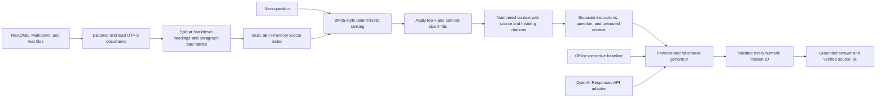

# Stage 3 RAG architecture

Stage 3 turns the repository's QA documentation into a citation-aware assistant.
The retrieval milestone established deterministic evidence selection. The
second milestone added a provider-neutral generator contract, an offline
extractive baseline, abstention, and fail-closed citation validation. The third
milestone adds an explicit OpenAI Responses API adapter while keeping real model
execution outside deterministic CI.

The grounding contract follows OpenAI's current
[GPT-5.6 prompting guidance](https://developers.openai.com/api/docs/guides/prompt-guidance-gpt-5p6.md):
state the desired outcome, treat retrieved content as evidence rather than
instructions, cite only retrieved sources, and narrow or abstain when evidence
is missing.

## Current flow

The public `QAKnowledgeBase` boundary accepts document paths and exposes
`search()` for ranked chunks and `context()` for generator-ready context.
`QAAssistant` retrieves evidence, abstains on no match, passes a separated
`GenerationRequest` to an `AnswerGenerator`, validates the returned numeric IDs,
and maps them back to source paths and headings. The CLI uses these same
boundaries, so tests exercise the production path instead of a separate demo.

## Why lexical retrieval first

BM25-style ranking rewards query terms that occur in a chunk while giving more
weight to terms that are rare across the indexed chunks. It also normalizes for
chunk length. Common English question words are removed so terms such as `Ruff`,
`coverage`, and `Playwright` drive the ranking. This provides several useful
properties for the first milestone:

- deterministic rankings make regression tests reliable;
- no external vector database or embedding API is required;
- exact QA terms such as `Playwright`, `coverage`, and `SQLite` work well;
- retrieval failures remain separate from generation failures.

The limitation is equally important: lexical ranking does not understand that
two differently worded phrases can mean the same thing. A later embedding or
hybrid retriever can improve semantic recall while these deterministic tests
remain as a baseline.

## Chunking and citations

The ingester recursively discovers `.md` and `.txt` files, rejects missing or
unsupported explicit sources, deduplicates paths, and reads UTF-8 text. Markdown
is split at headings, except inside fenced code blocks. Oversized sections are
split at paragraph and word boundaries.

Every chunk retains:

- its display path;
- the nearest Markdown heading;
- its position in the source document;
- its normalized section text.

Retrieved context labels each passage as `[n] path :: heading`. Generators are
required to cite these identifiers, and Stage 4 evaluation will verify that
cited passages actually support the answer.

The default generator is an offline extractive baseline. It returns a bounded
passage from the top-ranked result with `[1]`. The OpenAI adapter implements the
same `AnswerGenerator.generate()` contract, receives instructions separately
from the user question and delimited untrusted context, bounds output tokens,
sets reasoning effort explicitly, and uses `store=False`. Selecting it requires
`--provider openai`, so ordinary local use and deterministic CI cannot make an
accidental paid request.

Citation validation currently guarantees that an answer is non-empty, contains
at least one citation, and references only identifiers present in the retrieved
context. It does not yet prove that every claim is semantically entailed by the
cited passage; that becomes an evaluation target in Stage 4.

## Testing strategy

| Level | What this milestone tests | Why it belongs there |
|---|---|---|
| Unit | tokenization, chunking, ranking, generator requests, OpenAI request mapping, citation validation, and abstention | Each rule is deterministic and isolated; the SDK client is replaced by a recording fake. |
| Integration | source paths → chunks → context → generator → verified answer | Verifies that retrieval and generation agree on citation contracts. |
| CLI component | retrieval, provider selection, supported answers, source lists, no-match behavior, and missing sources | Exercises the user entry point without a real external request. |
| External E2E | identical source and question → Sol/Medium and Luna/High → citation and fact checks | Opt-in only through `RUN_OPENAI_LIVE_TESTS=1`; two paid calls produce HTML/JUnit comparison evidence and remain excluded from deterministic CI. |

This follows the testing pyramid: many fast unit cases, fewer boundary tests,
and eventually a small number of end-to-end assistant journeys.

## Stage 3 boundaries and next milestones

This milestone proves grounded answer orchestration with both a deliberately
simple offline generator and a secure external provider boundary. The remaining
Stage 3 work is:

1. Run and review the controlled Sol/Medium versus Luna/High comparison, then
   expand it with representative unsupported questions.
2. Add semantic support checks, prompt-injection cases, and unsupported-answer
   evaluation beyond numeric citation validity.
3. Implement the three planned Stage 3 algorithm lessons: Valid Parentheses for
   structured-output validation, LRU Cache for retrieval caching, and Trie for
   document-prefix indexing.
4. Add a small end-to-end chatbot journey and retained test evidence.
