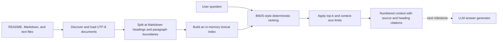

# Stage 3 RAG architecture

Stage 3 turns the repository's QA documentation into a citation-aware assistant.
The first milestone deliberately implements retrieval before answer generation,
so search quality can be tested without network access, API credentials, or
non-deterministic model output.

## Current flow

The public `QAKnowledgeBase` boundary accepts document paths and exposes
`search()` for ranked chunks and `context()` for generator-ready context. The
CLI uses the same boundary, so tests exercise the production path instead of a
separate demo implementation.

## Why lexical retrieval first

BM25-style ranking rewards query terms that occur in a chunk while giving more
weight to terms that are rare across the indexed chunks. It also normalizes for
chunk length. Common English question words are removed so terms such as `Ruff`,
`coverage`, and `Playwright` drive the ranking. This provides several useful
properties for the first milestone:

- deterministic rankings make regression tests reliable;
- no external vector database or embedding API is required;
- exact QA terms such as `Playwright`, `coverage`, and `SQLite` work well;
- retrieval failures remain separate from generation failures.

The limitation is equally important: lexical ranking does not understand that
two differently worded phrases can mean the same thing. A later embedding or
hybrid retriever can improve semantic recall while these deterministic tests
remain as a baseline.

## Chunking and citations

The ingester recursively discovers `.md` and `.txt` files, rejects missing or
unsupported explicit sources, deduplicates paths, and reads UTF-8 text. Markdown
is split at headings, except inside fenced code blocks. Oversized sections are
split at paragraph and word boundaries.

Every chunk retains:

- its display path;
- the nearest Markdown heading;
- its position in the source document;
- its normalized section text.

Retrieved context labels each passage as `[n] path :: heading`. A future
generator will be instructed to cite these identifiers, and Stage 4 evaluation
will verify that cited passages actually support the answer.

## Testing strategy

| Level | What this milestone tests | Why it belongs there |
|---|---|---|
| Unit | tokenization, path discovery, heading parsing, chunk limits, ranking, ties, and context budgets | Each rule is deterministic and isolated. |
| Integration | source paths → loaded documents → chunks → ranked cited context | Verifies the ingestion and retrieval components agree on their contracts. |
| CLI component | repeated source arguments, successful retrieval, no-match behavior, and missing sources | Exercises the user entry point without an external model or network. |
| E2E | Deferred until answer generation exists | A real user journey needs both retrieval and a generator. |

This follows the testing pyramid: many fast unit cases, fewer boundary tests,
and eventually a small number of end-to-end assistant journeys.

## Stage 3 boundaries and next milestones

This milestone retrieves evidence; it does not claim to answer questions. The
remaining Stage 3 work is:

1. Add a generator interface, deterministic fake generator tests, and an
   explicitly external real-model adapter.
2. Require answers to reference retrieved citation identifiers and add
   prompt-injection and unsupported-answer checks.
3. Implement the three planned Stage 3 algorithm lessons: Valid Parentheses for
   structured-output validation, LRU Cache for retrieval caching, and Trie for
   document-prefix indexing.
4. Add a small end-to-end chatbot journey and retained test evidence.
