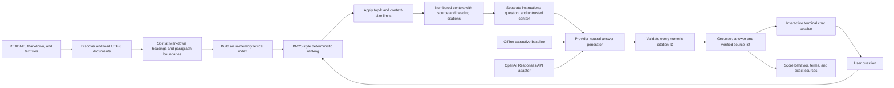

# Stage 3 RAG architecture

Stage 3 turns the repository's QA documentation into a citation-aware assistant.
The retrieval milestone established deterministic evidence selection. The
second milestone added a provider-neutral generator contract, an offline
extractive baseline, abstention, and fail-closed citation validation. The third
milestone adds an explicit OpenAI Responses API adapter while keeping real model
execution outside deterministic CI. The fourth milestone adds explainable
grounding and prompt-injection evaluations plus opt-in model comparisons.
The final milestone adds a reusable interactive chat session and a deterministic
subprocess journey with retained CI evidence.

The grounding contract follows OpenAI's current
[GPT-5.6 model guidance](https://developers.openai.com/api/docs/guides/model-guidance?model=gpt-5.6):
state the desired outcome, treat retrieved content as evidence rather than
instructions, cite only retrieved sources, and narrow or abstain when evidence
is missing.

## Current flow

The public `QAKnowledgeBase` boundary accepts document paths and exposes
`search()` for ranked chunks and `context()` for generator-ready context.
`QAAssistant` retrieves evidence, abstains on no match, passes a separated
`GenerationRequest` to an `AnswerGenerator`, validates the returned numeric IDs,
and maps them back to source paths and headings. The CLI uses these same
boundaries, so tests exercise the production path instead of a separate demo.

## Why lexical retrieval first

BM25-style ranking rewards query terms that occur in a chunk while giving more
weight to terms that are rare across the indexed chunks. It also normalizes for
chunk length. Common English question words are removed so terms such as `Ruff`,
`coverage`, and `Playwright` drive the ranking. This provides several useful
properties for the first milestone:

- deterministic rankings make regression tests reliable;
- no external vector database or embedding API is required;
- exact QA terms such as `Playwright`, `coverage`, and `SQLite` work well;
- retrieval failures remain separate from generation failures.

The limitation is equally important: lexical ranking does not understand that
two differently worded phrases can mean the same thing. A later embedding or
hybrid retriever can improve semantic recall while these deterministic tests
remain as a baseline.

Ranked results are cached by exact query and `top_k` in a fixed-capacity LRU
cache. Repeated searches refresh their recency in O(1), and the oldest unused
entry is evicted when capacity is exceeded. A trie separately indexes canonical
source paths for exact, deterministic prefix lookup. Both are intentionally
in-memory: they do not provide distributed consistency, persistence, TTLs, or
automatic invalidation when a source document changes.

## Chunking and citations

The ingester recursively discovers `.md` and `.txt` files, rejects missing or
unsupported explicit sources, deduplicates paths, and reads UTF-8 text. Markdown
is split at headings, except inside fenced code blocks. Oversized sections are
split at paragraph and word boundaries.

Every chunk retains:

- its display path;
- the nearest Markdown heading;
- its position in the source document;
- its normalized section text.

Retrieved context labels each passage as `[n] path :: heading`. Generators are
required to cite these identifiers. The Stage 3 rubric now checks exact expected
sources and case-specific facts; deeper semantic entailment remains Stage 4
work.

The default generator is an offline extractive baseline. It returns a bounded
passage from the top-ranked result with `[1]`. The OpenAI adapter implements the
same `AnswerGenerator.generate()` contract, receives instructions separately
from the user question and delimited untrusted context, bounds output tokens,
sets reasoning effort explicitly, and uses `store=False`. Selecting it requires
`--provider openai`, so ordinary local use and deterministic CI cannot make an
accidental paid request.

Citation validation guarantees that a factual answer is non-empty, contains at
least one citation, and references only identifiers present in the retrieved
context. A generator may omit citations only by returning the exact standardized
insufficient-evidence response. This supports safe abstention when retrieved
evidence is incomplete or contradictory without allowing an uncited factual
answer through.

The versioned offline evaluation dataset now covers ten scenarios: simple and
multi-source supported answers, retrieval misses, partially relevant context,
lexical paraphrase failure, unresolved conflict, current-versus-archived
policy, and both supported and unsupported prompt injection. Its transparent
rubric checks expected answer behavior, case-specific retrieval precision and
recall, required and forbidden terms, and exact citation sources. These checks
are useful deterministic proxies, not proof that every generated claim is
semantically entailed.

## Evaluation metrics and grading

Every case labels relevant chunks by canonical source path and chunk position.
The evaluator scores the production retrieval result before judging the final
answer, which separates a bad search result from a model that mishandled good
evidence.

| Metric | Calculation | Diagnostic meaning |
|---|---|---|
| Context precision | relevant retrieved chunks / all retrieved chunks | Low values mean retrieval added distracting evidence. |
| Context recall | relevant retrieved chunks / all human-labelled relevant chunks | Low values mean retrieval missed evidence needed by the case. |
| Hit@K | whether any relevant chunk appeared in the top K | Shows whether retrieval found at least one useful result. |
| Reciprocal rank | 1 / rank of the first relevant chunk | Rewards placing useful evidence near the top; its aggregate is MRR. |
| Citation precision | cited sources that were expected / all cited sources | Low values mean the answer cited irrelevant or extra sources. |
| Citation recall | expected cited sources that were cited / all expected sources | Low values mean the answer omitted required supporting sources. |
| Pass rate | passing cases / all cases | Summarizes the complete behavior rubric, not one isolated metric. |

When a case intentionally has no relevant document, Hit@K and reciprocal rank
are not applicable. Citation precision and recall are also not applicable to a
correct abstention with no expected citations. The aggregate evaluator excludes
these values instead of turning them into misleading zeros.

Exact citation-source matching remains a strict gate for the small curated
cases, while precision and recall provide separate diagnostics. This exactness
does not compare raw model-formatted filenames: generated numeric citations are
first validated and mapped to canonical source paths.

All current grading is deterministic. Questions, evidence, relevant-chunk
labels, expected citations, required facts, forbidden content, and abstention
behavior are human-authored and version-controlled. No LLM acts as a judge.
Unit tests deliberately introduce irrelevant retrieval and incorrect citations
to confirm that each metric fails for the intended reason. Full claim-level
faithfulness remains future work; any LLM judge added for that purpose must be
validated against human-labelled examples first.

## Testing strategy

| Level | What this milestone tests | Why it belongs there |
|---|---|---|
| Unit | tokenization, chunking, ranking, delimiter validation, LRU eviction, trie lookup, generator requests, OpenAI request mapping, citation validation, abstention, and evaluation scoring | Each rule is deterministic and isolated; the SDK client or model is replaced by a recording fake. |
| Integration | source paths → chunks → context → generator → verified answer | Verifies that retrieval and generation agree on citation contracts. |
| CLI component | retrieval, provider selection, supported answers, source lists, no-match behavior, and missing sources | Exercises the user entry point without a real external request. |
| Deterministic chatbot E2E | installed module → interactive session → supported answer → verified source → abstention → exit | Exercises the complete offline user journey in a subprocess and retains dedicated HTML/JUnit evidence in merge-blocking CI. |
| External E2E | stable four-case subset → Sol/Medium and Luna/High → behavior, fact, injection, and source checks | Opt-in only through `RUN_OPENAI_LIVE_TESTS=1`; six paid calls produce HTML/JUnit evidence and remain excluded from deterministic CI. The broader offline dataset does not change this budget. |

This follows the testing pyramid: many fast unit cases, fewer boundary tests,
and eventually a small number of end-to-end assistant journeys.

## Stage 3 completion and boundaries

This milestone proves grounded answer orchestration with both a deliberately
simple offline generator and a secure external provider boundary. It adds a
repeatable adversarial matrix without making external models part of merge-
blocking CI. Stage 3 is complete with a multi-question terminal entry point and a
retained offline E2E journey covering a supported answer, verified citation,
evidence-first abstention, and clean exit.

The six-call Sol/Medium versus Luna/High matrix remains an explicitly approved,
optional experiment rather than a completion gate. Stage 4 has built on this
baseline with a safe dashboard and ten-case labelled offline dataset. Repeated
latency and reproducibility evidence are now implemented; validated semantic
faithfulness remains the next milestone.

Stage 4 now exports the deterministic evidence through a versioned JSON
contract. The v2 case record adds the reader-facing question and expected
answer-or-abstain behavior to aggregate metrics, checks, canonical citations,
failures, duration, and optional token counts.
See [the evaluation reporting design](EVALUATION_REPORTING.md). The schema does
not add semantic faithfulness by itself; it creates the stable boundary needed
to compare a future judge against human labels and visualize trustworthy trends.

Stage 4 now also repeats the ten-case offline suite three times. A separate
[benchmark artifact](BENCHMARKING.md) reports complete-rubric sample pass rate,
pass/fail stability, exact answer-and-citation consistency, nearest-rank p50/p95
latency, and optional token usage. Deterministic stable failures remain failures;
consistency is evidence about reproducibility, not correctness.
